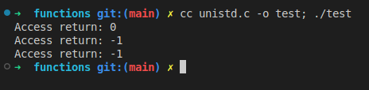
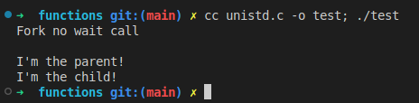
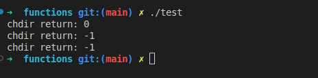
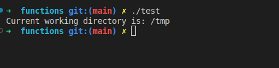
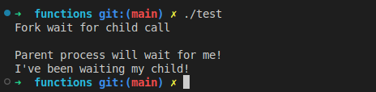
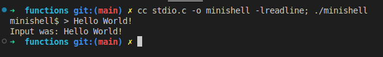
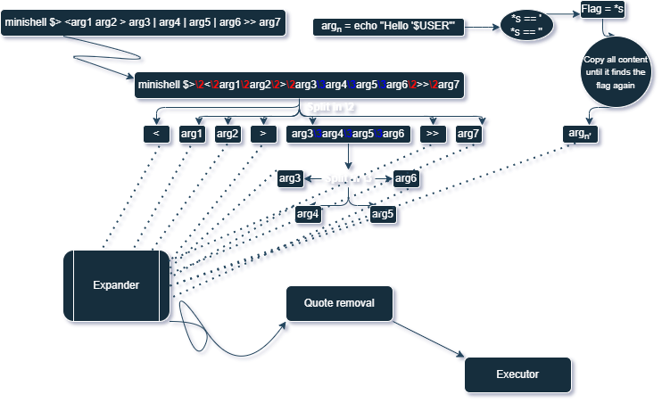

# Minishell

**42 Introduction:**
>The existence of shells is linked to the very existence of IT.
At the time, all developers agreed that communicating with a computer using aligned 1/0 switches was seriously irritating.
It was only logical that they came up with the idea of creating a software to communicate with a computer using interactive lines of commands in a language somewhat close to the human language.
Thanks to Minishell, you’ll be able to travel through time and come back to problems people faced when Windows didn’t exist.


[Evaluation sheet](https://github.com/HTOMAS-D/school21-checklists/blob/master/ng_3_minishell.pdf)
##### Index
- [Functions](#functions)
- [Lexer](#lexer)


## Mandatory


  **Your shell should:**

• Display a prompt when waiting for a new command.

• Have a working history.

• Search and launch the right executable (based on the PATH variable or using a relative or an absolute path)

• Avoid using more than one global variable to indicate a received signal. Consider the implications: this approach ensures that your signal handler will not access your main data structures.

>**Be careful. This global variable cannot provide any other
information or data access than the number of a received signal.
Therefore, using "norm" type structures in the global scope is
forbidden.
• Not interpret unclosed quotes or special characters which are not required by the subject such as \ (backslash) or ; (semicolon).**


• Handle ’ (single quote) which should prevent the shell from interpreting the meta-characters in the quoted sequence.

• Handle " (double quote) which should prevent the shell from interpreting the meta-characters in the quoted sequence except for $ (dollar sign).

• Implement redirections:
◦ < should redirect input.
◦ > should redirect output.
◦ << should be given a delimiter, then read the input until a line containing the
delimiter is seen. However, it doesn’t have to update the history!
◦ >> should redirect output in append mode.

• Implement pipes (| character). The output of each command in the pipeline is connected to the input of the next command via a pipe.

• Handle environment variables ($ followed by a sequence of characters) which
should expand to their values.

• Handle $? which should expand to the exit status of the most recently executed foreground pipeline.
• Handle ctrl-C, ctrl-D and ctrl-\ which should behave like in bash.
• In interactive mode:
◦ ctrl-C displays a new prompt on a new line.
◦ ctrl-D exits the shell.
◦ ctrl-\ does nothing.


• Your shell must implement the following builtins:
◦ echo with option -n
◦ cd with only a relative or absolute path
◦ pwd with no options
◦ export with no options
◦ unset with no options
◦ env with no options or arguments
◦ exit with no options


## Functions


[Back to Index](#index)
| Library   | Functions |
|-----------|-----------|
| **unistd.h**  | [access](#access), [fork](#fork), read, write,  [getcwd](#getcwd), [chdir](#chdir), execve, dup, dup2, pipe, isatty, ttyname, ttyslot |
| **fcntl.h**|open, close, unlink|
| **wait.h** |[wait](#wait), waitpid, wait3, wait4|
| **stdio.h**| printf, [readline](#readline) |
| **stdlib.h** | malloc, free, exit, getenv |
| **dirent.h** | opendir, readdir, closedir |
| **string.h** | strerror, perror |
| **termios.h** | tcsetattr, tcgetattr |
| **term.h**| tgetent, tgetflag, tgetnum, tgetstr, tgoto, tputs |
| **signal.h**  | signal, sigaction, sigemptyset, sigaddset, kill |
| **sys/stat.h**| stat, lstat, fstat |
|**stropts.h**| ioctl|


### unistd.h


#### access
[Back to top](#functions)

**detefunctions accessibility of a file descriptor**

***access definition in unistd.h***
```c
/* Values for the second argument to access.
   These may be OR'd together.  */
#define	R_OK	4		/* Test for read permission.  */
#define	W_OK	2		/* Test for write permission.  */
#define	X_OK	1		/* Test for execute permission.  */
#define	F_OK	0		/* Test for existence.  */

/* Test for access to NAME using the real UID and real GID.  */
extern int access (const char *__name, int __type) __THROW __nonnull ((1));

```
```c
int		main(void)
{
	int		res[3];
	int		i;

	res[0] = access("/bin/ls", 0);	//Returns 0, as right execution
	res[1] = access("ls", 0);	//Without the absolute path returns an error
	res[2] = access("/bin/cd", 0);	//Since the "cd" command doesn't exist in the /bin, returns an error
	for(i = 0; i < 3; i++)
		printf("Access return: %i\n", res[i]);
}
```


___

#### fork
[Back to top](#functions)

**creafunctionsnew process**

***fork definition in the unistd.h***
```c
/* Clone the calling process, creating an exact copy.
   Return -1 for errors, 0 to the new process,
   and the process ID of the new process to the old process.  */
extern __pid_t fork (void) __THROWNL;
```

```c
int	main()
{
	pid_t	pid;

	printf("Fork no wait call\n\n");
	pid = fork();
	if (pid == 0) // If it's the child proccess
		printf("I'm the child!\n");
	else
		printf("I'm the parent!\n");
}
```

___

#### chdir

[Back to top](#functions)

**change working directory**
int	chdir(const char *path);
> The chdir() function shall cause the directory named by the pathname pointed to by the path argument to become the current working directory; that is, the starting point for  path  searches for pathnames not beginning with '/'.

```c
int	main()
{
	int		i;
	int		ret[3];

	ret[0] = chdir("/tmp");
	ret[1] = chdir("");
	ret[2] = chdir(NULL);
	for(i=0; i<3; i++)
		printf("chdir return: %i\n", ret[i]);
}
```


#### getcwd

[Back to top](#functions)

**get current working directory**
>The getcwd() function copies an absolute pathname of the current working directory to the array pointed to by buf, which is of length size.
> If the length of the absolute pathname of the current working directory, including  the  terminating null byte, exceeds size bytes, NULL is returned, and errno is set to ERANGE; an application should check for this error, and allocate a larger buffer if necessary.

```c
int	main()
{
	char	cwd[256];

	if (chdir("/tmp") != 0)
		perror("chdir() error()");
	else
	{
		if (getcwd(cwd, sizeof(cwd)) == NULL)
			perror("getcwd() error()");
		else
			printf("Current working directory is: %s\n", cwd);
	}
}
```



#### execve

[Back to top](#functions)

**execute a file**
int	execve(const char *path, char *const argv[], char *const envp[]);

```c
```
### wait.h


#### wait

[Back to top](#functions)

**wait a child process to stop or terminate**
```c
int	main()
{
	pid_t	pid;

	printf("Fork wait for child call\n\n");
	pid = fork();
	if (pid != 0) // If it's not the child
	{
		wait(NULL);
		printf("I've been waiting my child!\n");
	}
	else
		printf("Parent process will wait for me!\n");
}
```


wait3, wait4


### signal.h
[Back to top](#functions)
	signal, sigaction, sigemptyset, sigaddset, kill


### stdlib.h
[Back to top](#functions)
	exit, getenv


### stat.h
[Back to top](#functions)
		stat, lstat, fstat


### dirent.h
[Back to top](#functions)
		opendir, readdir, closedir


### string.h
[Back to top](#functions)
		strerror


### stdio.h


#### readline
```c
char	*readline (const char* prompt)
```
[Back to top](#functions)
**get a line from a user with editing**

>readline will read a line from the terminal and return it, using prompt as a prompt.  If prompt is NULL or the empty string, no prompt is issued.  The line returned  is  allocated  with  malloc(3);  the  caller  must  free it when finished.  The line returned has the final newline removed, so only the text of the line remains.

```c
#include <stdio.h>
#include <stdlib.h>
#include <readline/readline.h>
#include <readline/history.h>
#include <string.h>

int	main(int ac, char **av)
{
	char	*input;
	char	*prompt;

	(void)ac;
	prompt = calloc(strlen(av[0] + 5), sizeof(char *)); // +5 to add the extra chars to look more like an terminal emulator
	if (!prompt)
		return (1);
	strcpy(prompt, (av[0] + 2)); // +2 to get rid of "./"
	strcat(prompt, "$ > ");
	input = readline(prompt);
	if (input){
		printf("Input was: %s\n", input);
		free(input);
	}
	free(prompt);
}
```

```bash
	-- bash $PS  (Prompt String) complete version:

	echo $PS1= \[\e]0;\u@\h: \w\a\]${debian_chroot:+($debian_chroot)}\[\033[01;32m\]\u@\h\[\033[00m\]:\[\033[01;34m\]\w\[\033[00m\]\$
	echo $PS2= >
	echo $PS3= '\n'
	echo $PS4= +

```


perror, printf


### stropts.h
[Back to top](#functions)
		ioctl


### termios.h
[Back to top](#functions)
		tcgetattr, tcsetattr,


### curses.h / term.h
[Back to top](#functions)
		tgetent, tgetflag, tgetnum, tgetstr, tgoto, tputs

## Lexer

[Back to Index](#index)





